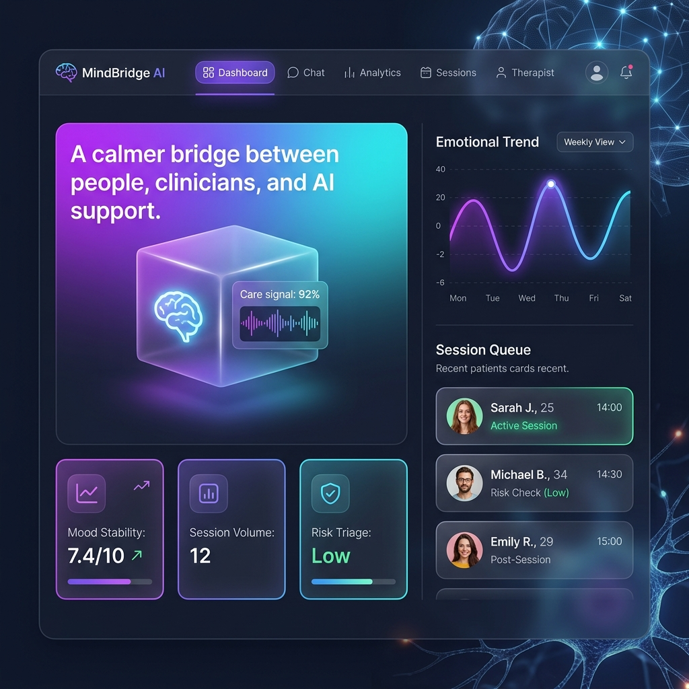
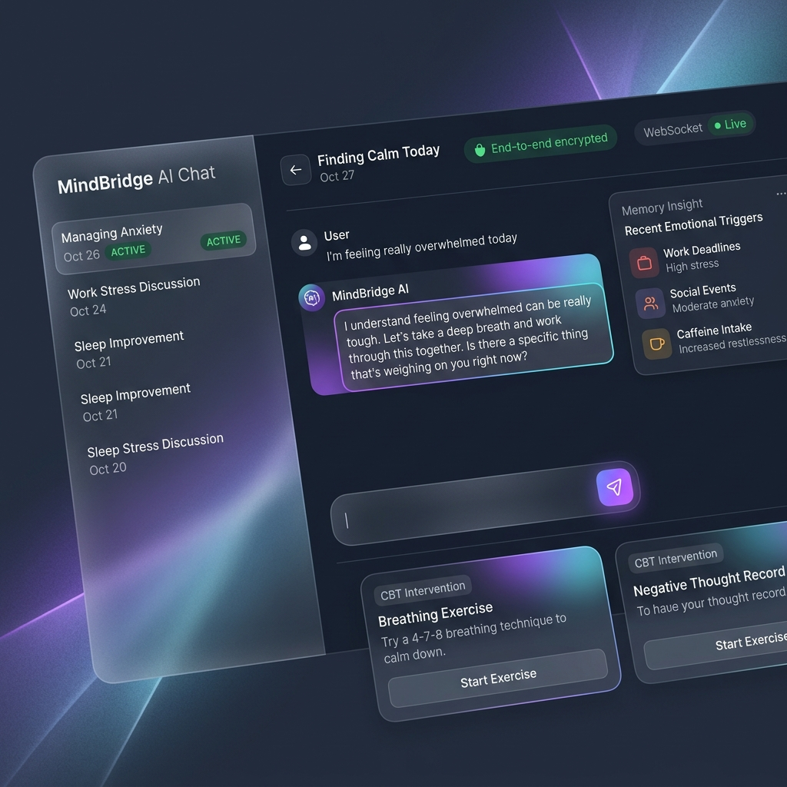
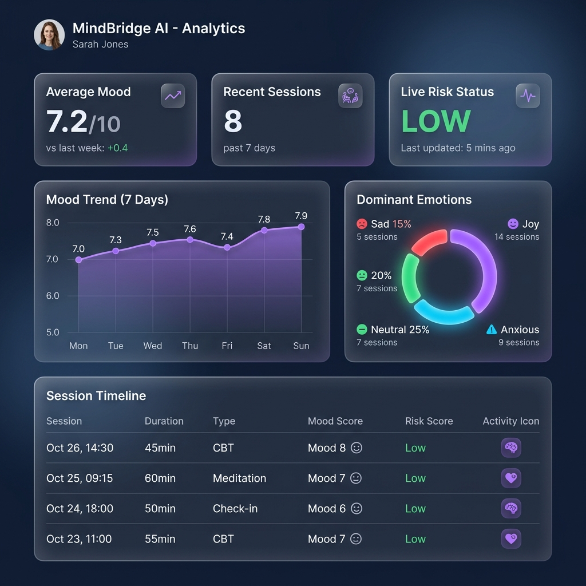
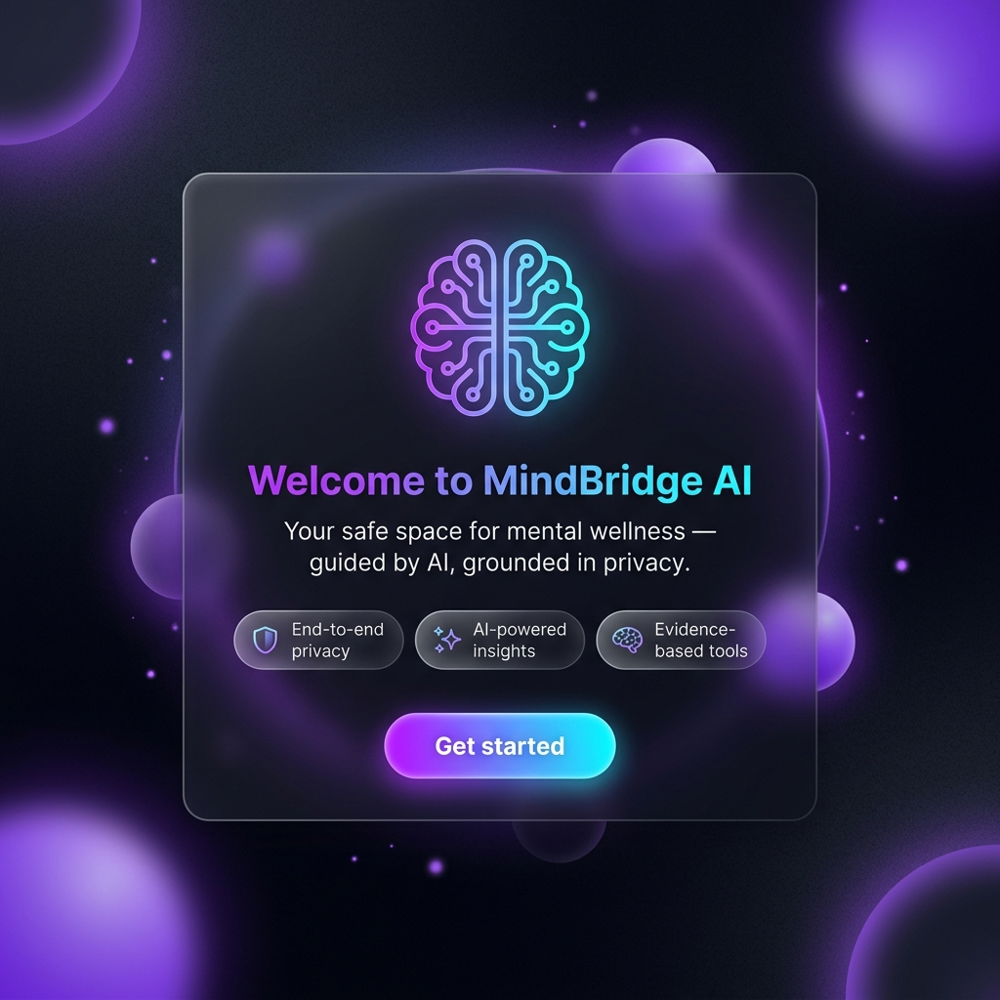

<div align="center">


# 🧠 MindBridge AI
### *Privacy-first, AI-powered Mental Wellness Platform*

> **A calmer bridge between people, clinicians, and AI support.**  
> Built for the **Google AI Hackathon 2026** · Powered by **Gemini AI**

[](LICENSE)
[](https://spring.io/projects/spring-boot)
[](https://react.dev)
[](https://ai.google.dev)
[](https://fastapi.tiangolo.com)
[](https://www.postgresql.org)
[](https://redis.io)
[](https://www.docker.com)

---

</div>

## 📸 Screenshots

<table>
  <tr>
    <td align="center"><b>🏠 Dashboard</b></td>
    <td align="center"><b>💬 AI Chat</b></td>
  </tr>
  <tr>
    <td></td>
    <td></td>
  </tr>
  <tr>
    <td align="center"><b>📊 Analytics</b></td>
    <td align="center"><b>🔐 Onboarding</b></td>
  </tr>
  <tr>
    <td></td>
    <td></td>
  </tr>
</table>

---

## 🚀 What is MindBridge AI?

**MindBridge AI** is a full-stack, production-ready mental wellness platform that combines **real-time AI conversation**, **emotion analysis**, **clinical risk triage**, and **end-to-end encrypted private chat** — all in a premium glassmorphism UI deployable with a single `docker compose up` command.

The platform bridges the gap between individuals seeking mental health support, AI-assisted cognitive tools, and clinical oversight — creating a safe, empathetic, and data-driven ecosystem.

### 🎯 Key Problems Solved

| Problem | MindBridge AI Solution |
|---|---|
| Mental health support is expensive & inaccessible | Free, AI-guided sessions available 24/7 |
| Traditional apps lack real emotional intelligence | Heuristic NLP engine with valence + arousal modeling |
| Privacy is a major concern in mental health apps | AES-256 message encryption, passwordless OTP auth |
| No feedback loop for clinical escalation | Automated risk scoring + therapist queue system |
| Therapy is reactive, not proactive | Mood trend analytics + CBT intervention widgets |

---

## ✨ Features

### 🤖 AI-Powered Therapy Chat
- Real-time WebSocket-based chat with **Gemini AI** as a context-aware empathetic therapist
- **Streaming responses** — AI replies appear word-by-word for a natural feel
- **Persistent memory mode** — AI remembers past session triggers and emotional patterns
- Emotion-tagged messages with **valence + arousal** metadata shown on each bubble
- **Typing indicators** for both user and AI sides

### 🧪 Custom NLP Emotion Engine
- A FastAPI-based Python service implementing a **VADER-inspired heuristic emotion lexicon**
- Processes 30+ Go-Emotions categories including `anxious`, `hopeless`, `love`, `gratitude`
- **Negation handling**: "not happy" → sadness; double-negative cancellation
- **Intensifier scaling**: "very angry" scores higher arousal than "angry"
- **Redis-backed caching** with zlib compression — repeat queries served in ~0ms
- Returns primary emotion, confidence score, valence, arousal, and full emotion distribution

### 📊 Real-Time Analytics Dashboard
- **7-day mood trend** line chart (Recharts)
- **Dominant emotion** donut chart with color distribution
- **Session timeline** with mood scores and risk scores per session
- Live WebSocket-subscribed **risk level updates** (LOW / MODERATE / HIGH)

### 🔐 Security & Privacy First
- **Passwordless OTP authentication** via Gmail SMTP — no passwords stored
- **JWT access tokens** (15-min) + **Refresh tokens** (7-day) with Redis-backed rotation
- **AES-256 per-user message encryption** with PBKDF2-derived keys
- **Rate limiting**: 60 req/min per IP, 120 req/min per user
- CORS scoped per environment

### 🚨 Clinical Risk Triage
- Multi-factor risk scoring system:
  - `KeywordClassifier` (40% weight): scans for crisis indicators
  - `TonalEmotionScorer` (40% weight): NLP-derived emotional intensity
  - `SessionBaselineAdjuster` (20% weight): compares against user's historical baseline
- Automatic escalation to **Therapist Queue** on `HIGH` risk detection
- `EscalationLog` entity tracks all risk events for audit

### 🎯 CBT Intervention Widgets
- Triggered automatically after high-distress messages
- Interactive **breathing exercises**, grounding techniques, journaling prompts
- `RecommendationLog` persists completion state for clinician review

### 🌓 Premium UI/UX
- Dark/Light mode toggle with system preference detection
- **Glassmorphism** panels with backdrop blur and frosted glass aesthetics
- **Framer Motion** micro-animations: spring transitions, scroll animations, stagger effects
- Fully responsive layout (mobile → desktop)
- Optimistic UI updates for instant feedback on message send

---

## 🏗️ System Architecture

```
┌─────────────────────────────────────────────────────────────────┐
│                        CLIENT LAYER                             │
│   React 18 + TypeScript + Vite │ Framer Motion │ Recharts      │
│   TailwindCSS │ Lucide Icons │ STOMP WebSocket Client           │
└────────────────────────┬────────────────────────────────────────┘
                         │ HTTP/REST + WebSocket (STOMP/SockJS)
                         ▼
┌─────────────────────────────────────────────────────────────────┐
│                    API GATEWAY / BACKEND                        │
│         Spring Boot 3.x │ Java 21 │ Port 8080                  │
│  ┌───────────────┐  ┌──────────────┐  ┌──────────────────────┐ │
│  │  Auth Service │  │ Core Service │  │   WebSocket Broker   │ │
│  │  JWT + OTP    │  │ Chat/Session │  │   STOMP + SockJS     │ │
│  │  Refresh Token│  │ Encryption   │  │   /ws endpoint       │ │
│  └───────────────┘  └──────────────┘  └──────────────────────┘ │
│  ┌──────────────────────────────────────────────────────────┐   │
│  │              Risk Scoring Engine                         │   │
│  │  KeywordClassifier (40%) + TonalEmotionScorer (40%)     │   │
│  │  + SessionBaselineAdjuster (20%)                         │   │
│  └──────────────────────────────────────────────────────────┘   │
└──────────┬──────────────────────┬──────────────────────┬────────┘
           │                      │                      │
           ▼                      ▼                      ▼
┌──────────────────┐  ┌───────────────────┐  ┌─────────────────┐
│   PostgreSQL 16  │  │   Redis 7 Alpine  │  │  Gemini API     │
│  (Primary Store) │  │  (Session Cache   │  │  (AI Therapy    │
│  Users, Messages │  │   NLP Cache       │  │   Responses)    │
│  Sessions, Logs  │  │   OTP Store       │  │                 │
│  AuditLog        │  │   Rate Limiter)   │  │                 │
└──────────────────┘  └─────────┬─────────┘  └─────────────────┘
                                │
                                ▼
                    ┌───────────────────────┐
                    │   NLP Service         │
                    │   FastAPI + Python    │
                    │   Port 8000           │
                    │   Emotion Analysis    │
                    │   Valence + Arousal   │
                    │   Redis Cache (zlib)  │
                    └───────────────────────┘
```

---

## 🔄 Data Flow Diagrams

### 1. User Authentication Flow (Passwordless OTP)

```
User                 Frontend              Backend              Gmail SMTP
 │                       │                    │                     │
 │── Enter Email ────────▶│                    │                     │
 │                       │── POST /auth/otp ──▶│                     │
 │                       │                    │── Generate OTP ─────│
 │                       │                    │── Store in Redis ──  │
 │                       │                    │── Send Email ───────▶│
 │                       │◀── 200 OK ─────────│                     │
 │◀── "Check your email" ─│                    │                     │
 │                       │                    │                     │
 │── Enter OTP ──────────▶│                    │                     │
 │                       │── POST /auth/verify▶│                     │
 │                       │                    │── Verify OTP ───────│
 │                       │                    │── Create/Find User ─│
 │                       │                    │── Issue JWT + Refresh│
 │                       │◀── Tokens + User ──│                     │
 │◀── Redirect Dashboard ─│                    │                     │
```

### 2. AI Chat Message Flow (Real-Time)

```
User         Frontend          Backend           NLP Service      Gemini API
 │               │                │                   │                │
 │─ Type Msg ───▶│                │                   │                │
 │               │─ WS SEND ─────▶│                   │                │
 │               │                │─ POST /analyse ──▶│                │
 │               │                │◀── Emotion Data ──│                │
 │               │                │─ Tag Message ────                  │
 │               │                │─ Risk Score ────                   │
 │               │                │─ POST /generate ─────────────────▶│
 │               │                │◀── Stream Delta ──────────────────│
 │               │◀─ WS STREAM ───│ (word by word)                    │
 │◀── Streaming Response ─────────│                   │                │
 │               │                │─ Save to DB ────                   │
 │               │                │─ Risk Check ────                   │
 │               │                │─ If HIGH → Escalation Queue        │
 │               │◀─ Interventions│ (CBT Widget Push)                  │
```

### 3. Risk Escalation Pipeline

```
┌──────────────────────────────────────────────────────────────┐
│                    Message Received                          │
└──────────────────────────┬───────────────────────────────────┘
                           │
              ┌────────────▼──────────────┐
              │    NLP Emotion Analysis    │
              │    valence + arousal       │
              └────────────┬──────────────┘
                           │
         ┌─────────────────▼──────────────────┐
         │          Risk Score Engine          │
         │  Keyword (40%) + Tonal (40%)        │
         │  + Baseline Comparison (20%)        │
         └─────────┬──────────────────┬────────┘
                   │                  │
           Score < 40           Score 40–64         Score ≥ 65
               │                    │                    │
               ▼                    ▼                    ▼
             LOW               MODERATE                HIGH
          (continue)       (log + soft alert)    (escalate to
                                                  therapist queue
                                                + push notification
                                                + audit log entry)
```

---

## 🗃️ Database Schema

```
┌─────────────────┐       ┌─────────────────────┐
│      users      │       │      sessions        │
├─────────────────┤       ├─────────────────────┤
│ id (PK)         │──────▶│ id (PK)              │
│ email (UNIQUE)  │       │ user_id (FK)         │
│ full_name       │       │ title                │
│ role            │       │ status (ACTIVE/CLOSED)│
│ anonymous       │       │ mood_score           │
│ created_at      │       │ risk_score           │
└─────────────────┘       │ created_at           │
                          └──────────┬──────────┘
                                     │
                          ┌──────────▼──────────┐
                          │      messages        │
                          ├─────────────────────┤
                          │ id (PK)              │
                          │ session_id (FK)      │
                          │ sender_type (USER/AI)│
                          │ content (AES-256)    │
                          │ emotion              │
                          │ emotion_score        │
                          │ valence              │
                          │ arousal              │
                          │ created_at           │
                          └─────────────────────┘

┌──────────────────┐      ┌──────────────────────┐
│  emotion_memory  │      │   escalation_logs     │
├──────────────────┤      ├──────────────────────┤
│ id (PK)          │      │ id (PK)              │
│ user_id (FK)     │      │ session_id (FK)       │
│ dominant_emotion │      │ risk_score           │
│ triggers (JSON)  │      │ trigger_reason       │
│ recent_summary   │      │ escalated_at         │
│ updated_at       │      └──────────────────────┘
└──────────────────┘

┌──────────────────────┐   ┌─────────────────────┐
│   therapist_queue    │   │  recommendation_logs│
├──────────────────────┤   ├─────────────────────┤
│ id (PK)              │   │ id (PK)             │
│ session_id (FK)      │   │ session_id (FK)     │
│ assigned_therapist   │   │ type (CBT/BREATHING)│
│ priority             │   │ completed           │
│ status               │   │ created_at          │
│ created_at           │   └─────────────────────┘
└──────────────────────┘
```

---

## 🛠️ Tech Stack

### Frontend
| Technology | Version | Purpose |
|---|---|---|
| React | 18.x | UI framework |
| TypeScript | 5.x | Type safety |
| Vite | 5.x | Build tool & dev server |
| TailwindCSS | 3.x | Utility-first styling |
| Framer Motion | 11.x | Animations & transitions |
| STOMP.js | 7.x | WebSocket client |
| Recharts | 2.x | Analytics charts |
| Lucide React | latest | Icon library |
| Zustand (via hooks) | — | Auth state management |

### Backend
| Technology | Version | Purpose |
|---|---|---|
| Spring Boot | 3.x | Application framework |
| Java | 21 (LTS) | Language runtime |
| Spring Security | 6.x | Auth + JWT |
| Spring WebSocket | — | STOMP messaging broker |
| Spring Data JPA | — | ORM layer |
| Spring Data Redis | — | Cache integration |
| Spring Mail | — | OTP delivery |
| Hibernate | 6.x | Database ORM |
| Gradle | 8.x | Build system |

### Infrastructure
| Technology | Version | Purpose |
|---|---|---|
| PostgreSQL | 16-alpine | Primary database |
| Redis | 7-alpine | Caching + session store |
| Docker Compose | v3.8 | Container orchestration |
| Nginx | alpine | Frontend reverse proxy |
| FastAPI | 0.x | NLP microservice |

### AI & NLP
| Technology | Purpose |
|---|---|
| Google Gemini API | Therapist-grade AI response generation |
| Custom VADER-inspired Engine | Real-time emotion analysis (valence/arousal) |
| Go-Emotions taxonomy | 30-class emotion categorization |
| Redis (zlib compressed) | NLP result caching |

---

## 🚀 Quick Start

### Prerequisites

- [Docker Desktop](https://www.docker.com/products/docker-desktop/) installed and running
- A [Google Gemini API Key](https://ai.google.dev/)
- A Gmail account with [App Passwords](https://support.google.com/accounts/answer/185833) enabled (for OTP delivery)

### 1. Clone the Repository

```bash
git clone https://github.com/your-username/mindbridge-ai.git
cd mindbridge-ai
```

### 2. Configure Environment Variables

Copy the example environment file:

```bash
cp .env.example .env
```

Edit `.env` with your credentials:

```env
# Database
POSTGRES_DB=mindbridge
POSTGRES_USER=mindbridge
POSTGRES_PASSWORD=your_secure_password

# JWT Security
JWT_SECRET=your-super-secret-jwt-key-at-least-32-chars

# Gemini AI
GEMINI_API_KEY=your_gemini_api_key_here

# Gmail SMTP (for OTP delivery)
GMAIL_USER=your.email@gmail.com
GMAIL_PASSWORD=your_gmail_app_password
```

### 3. Launch the Platform

```bash
docker compose up --build
```

This starts 5 containers:
| Container | Port | Description |
|---|---|---|
| `mindbridge-frontend` | `3000` | React UI (served via Nginx) |
| `mindbridge-backend` | `8080` | Spring Boot API Gateway |
| `mindbridge-nlp` | `8000` | Python NLP microservice |
| `mindbridge-postgres` | `5432` | PostgreSQL database |
| `mindbridge-redis` | `6379` | Redis cache |

### 4. Open the App

Navigate to **http://localhost:3000** in your browser.

---

## 📁 Project Structure

```
mindbridge-ai/
├── 📂 frontend/                  # React + TypeScript SPA
│   ├── src/
│   │   ├── 📂 pages/             # Route-level page components
│   │   │   ├── OnboardingPage.tsx      # Login / OTP auth
│   │   │   ├── DashboardPage.tsx       # Main overview
│   │   │   ├── ChatPage.tsx            # Real-time AI chat
│   │   │   ├── AnalyticsDashboardPage.tsx  # Mood analytics
│   │   │   ├── SessionHistoryPage.tsx  # Past sessions
│   │   │   └── TherapistDashboardPage.tsx  # Clinical view
│   │   ├── 📂 components/        # Reusable UI components
│   │   │   ├── GlassCard.tsx           # Glassmorphism card
│   │   │   ├── MessageBubble.tsx       # Chat message
│   │   │   ├── InterventionWidget.tsx  # CBT intervention card
│   │   │   ├── StatCard.tsx            # Metric stat card
│   │   │   ├── SignalWave.tsx          # Animated EEG wave
│   │   │   └── TypingIndicator.tsx     # AI typing dots
│   │   ├── 📂 services/          # API client layer
│   │   │   ├── auth.ts                 # Auth API calls
│   │   │   ├── chat.ts                 # Chat & session APIs
│   │   │   ├── websocket.ts            # STOMP client wrapper
│   │   │   ├── analytics.ts            # Analytics API
│   │   │   └── recommendations.ts      # Intervention API
│   │   └── 📂 store/             # State management
│   │       └── auth-store.ts           # Auth state (React context)
│
├── 📂 backend/                   # Spring Boot monorepo
│   ├── 📂 api-gateway/           # Main gateway module (port 8080)
│   │   └── src/main/resources/
│   │       └── application.yml         # Full config + risk weights
│   ├── 📂 auth-service/          # Auth module
│   │   └── src/main/java/com/mindbridge/auth/
│   │       ├── controller/             # Auth REST endpoints
│   │       ├── dto/                    # Request/Response DTOs
│   │       ├── jwt/                    # JWT provider & filters
│   │       └── service/                # OTP + user service
│   ├── 📂 core-service/          # Business logic module
│   │   └── src/main/java/com/mindbridge/core/
│   │       ├── controller/             # Admin REST endpoints
│   │       ├── entity/                 # JPA entities (12 tables)
│   │       ├── repository/             # Spring Data repos
│   │       ├── service/                # Encryption + session logic
│   │       └── seeder/                 # Dev data seeder
│   ├── build.gradle              # Root Gradle config
│   └── Dockerfile                # Multi-stage Spring Boot build
│
├── 📂 nlp-service/               # Python FastAPI NLP microservice
│   ├── main.py                   # Emotion analysis engine
│   ├── requirements.txt          # Python dependencies
│   └── Dockerfile                # Python container
│
├── 📂 db/
│   └── init.sql                  # Database schema initialization
│
├── 📂 docs/
│   └── screenshots/              # UI screenshots
│
├── docker-compose.yml            # Full stack orchestration
└── .env                          # Environment configuration
```

---

## 🔌 API Reference

### Authentication

| Method | Endpoint | Description |
|---|---|---|
| `POST` | `/auth/otp/send` | Send OTP to email |
| `POST` | `/auth/otp/verify` | Verify OTP + issue tokens |
| `POST` | `/auth/refresh` | Refresh JWT access token |
| `POST` | `/auth/anonymous` | Create anonymous session |
| `POST` | `/auth/logout` | Revoke refresh token |

### Chat & Sessions

| Method | Endpoint | Description |
|---|---|---|
| `GET` | `/api/sessions` | List user's chat sessions |
| `POST` | `/api/sessions` | Create new chat session |
| `GET` | `/api/sessions/{id}/messages` | Get session message history |
| `GET` | `/api/memory/insight` | Get user's emotion memory |
| `POST` | `/api/recommendations` | Get CBT intervention suggestions |

### Analytics

| Method | Endpoint | Description |
|---|---|---|
| `GET` | `/api/analytics/mood-trend/{userId}` | 7-day mood trend data |
| `GET` | `/api/analytics/emotion-distribution/{userId}` | Emotion pie chart data |
| `GET` | `/api/analytics/session-timeline/{userId}` | Session history with scores |

### WebSocket (STOMP)

| Topic | Direction | Description |
|---|---|---|
| `/ws` | Connect | WebSocket endpoint |
| `/app/chat/{sessionId}` | Publish | Send chat message |
| `/app/typing/{sessionId}` | Publish | Send typing indicator |
| `/topic/session/{sessionId}` | Subscribe | Receive messages + stream deltas |
| `/topic/risk/{userId}` | Subscribe | Receive live risk alerts |

### NLP Service (Internal)

| Method | Endpoint | Description |
|---|---|---|
| `POST` | `/analyse` | Analyze text for emotion, valence, arousal |
| `GET` | `/health` | Service health check |

---

## 🔒 Security Architecture

```
┌─────────────────────────────────────────────────────────────┐
│                    Security Layers                          │
├─────────────────────────────────────────────────────────────┤
│  1. Transport: HTTPS/WSS enforcement (TLS_ENFORCE flag)     │
│  2. Auth:      Passwordless OTP → JWT (15min) + Refresh     │
│  3. Storage:   AES-256 per-user message encryption          │
│  4. Rate:      60 req/min per IP, 120 req/min per user      │
│  5. CORS:      Scoped to trusted origins only               │
│  6. Keys:      PBKDF2-derived encryption keys (not stored)  │
│  7. Audit:     Every sensitive action logged to AuditLog    │
└─────────────────────────────────────────────────────────────┘
```

**Message Encryption**: Each user's messages are encrypted with a **PBKDF2-derived AES-256 key** derived from their user ID and a master secret. Keys are never stored — they are re-derived on-demand, meaning even a database breach exposes only ciphertext.

---

## 🧠 NLP Engine — How It Works

The custom NLP service implements a **VADER-inspired heuristic emotion analysis engine**:

```python
# Simplified flow
text = "I'm not very happy today"

# 1. Tokenize
words = ["I'm", "not", "very", "happy", "today"]

# 2. Check for negations (within 2-word window)
# "not" before "happy" → negate

# 3. Check for intensifiers
# "very" → multiplier = 1.5

# 4. Lookup lexicon
# "happy" → {emotion: "joy", valence: 0.9, arousal: 0.5}

# 5. Apply modifiers
# negated joy → sadness
# valence: 0.9 * 1.5 * -0.7 = -0.945 (clamped to -1.0)

# 6. Output
{
  "emotion": "sadness",
  "confidence": 0.84,
  "valence": -0.94,
  "arousal": -0.40,
  "all_emotions": {"sadness": 0.84, "joy": 0.02, ...}
}
```

**Performance**: Results cached in Redis with zlib compression → ~0ms for repeat queries, ~15–30ms for first analysis.

---

## 🎨 Design System

MindBridge AI uses a custom design system built on TailwindCSS:

| Token | Value | Usage |
|---|---|---|
| `--primary` | `#8b5cf6` (violet-500) | Brand primary |
| `--secondary` | `#0ea5e9` (sky-500) | Accents, links |
| `--canvas-dark` | `#0a0a14` | Page background |
| `--surface` | `rgba(255,255,255,0.06)` | Glass panel surface |
| `--border` | `rgba(255,255,255,0.10)` | Panel borders |
| `--brand-gradient` | `violet → sky` | CTAs, icons |
| `--shadow-glow` | `0 0 24px violet/40` | Glow effects |

**Glassmorphism**: All panels use `backdrop-blur-xl` + semi-transparent backgrounds + subtle borders — creating depth without heavy shadows.

---

## 🔮 Roadmap

- [ ] **Voice mode** — speak to the AI therapist via Web Speech API
- [ ] **Mobile app** — React Native companion app
- [ ] **Therapist portal** — Full clinical dashboard for assigned therapists
- [ ] **Group sessions** — Moderated peer support circles
- [ ] **Crisis hotline integration** — Auto-dial escalation for critical risk events
- [ ] **FHIR compliance** — Healthcare data interoperability standard
- [ ] **Multi-language NLP** — Emotion analysis for non-English languages

---

## 🤝 Contributing

Contributions are welcome! Please read our [Contributing Guidelines](CONTRIBUTING.md) before submitting a PR.

```bash
# Fork + clone
git clone https://github.com/your-username/mindbridge-ai.git

# Create feature branch
git checkout -b feature/your-amazing-feature

# Commit changes
git commit -m "feat: add amazing feature"

# Push and create PR
git push origin feature/your-amazing-feature
```

---

## 📄 License

This project is licensed under the **MIT License** — see the [LICENSE](LICENSE) file for details.

---

## 🙏 Acknowledgements

- **Google Gemini API** — for powering the empathetic AI therapy responses
- **Spring Boot** — for the battle-tested, production-grade backend foundation
- **Framer Motion** — for the stunning micro-animations
- **Recharts** — for beautiful data visualization
- **FastAPI** — for the lightning-fast NLP microservice

---

<div align="center">

**Built with ❤️ for the Google AI Hackathon 2026**

*MindBridge AI — Making mental wellness accessible, private, and intelligent.*

</div>
